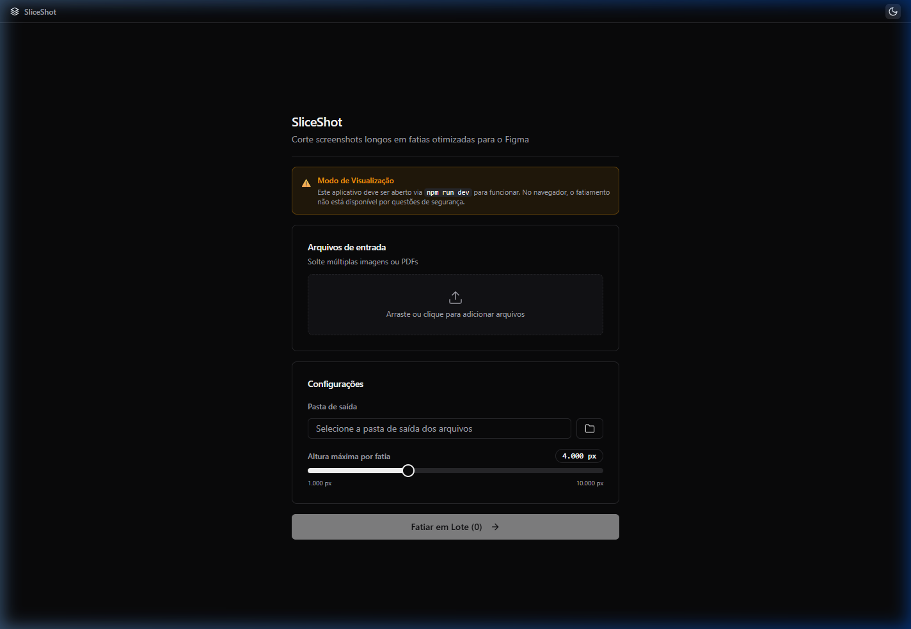

# SliceShot (v1.0.0) 📸

**Corte screenshots longos em fatias otimizadas para o Figma com precisão e qualidade.**



## 📋 O que é o SliceShot?

O **SliceShot** é uma ferramenta de produtividade desenvolvida para designers e desenvolvedores que trabalham com o Figma. Ele resolve o problema comum de perda de resolução ao importar imagens extremamente longas (como capturas de tela de landing pages inteiras). 

Através de um motor de processamento robusto (Sharp), o SliceShot divide automaticamente seus arquivos PNG, JPEG, WEBP ou PDF em fatias menores e gerenciáveis, mantendo a fidelidade visual 1:1.

## ✨ Principais Diferenciais

- 🚀 **Processamento em Lote**: Arraste vários arquivos de uma vez.
- 📐 **Customização Total**: Controle a altura exata de cada fatia.
- 🌗 **Interface Premium**: Design moderno com suporte nativo a Dark Mode e animações fluidas.
- ⚡ **Performance**: Utiliza aceleração de hardware e processamento assíncrono.
- 🌉 **Arquitetura Monorepo**: Código limpo, modular e fácil de manter.

## 🛠️ Como Usar (Passo a Passo)

1. **Instalação**: Clone o repositório e instale as dependências.
   ```bash
   npm install
   ```
2. **Inicie o App**: 
   ```bash
   npm run dev
   ```
3. **Adicione Arquivos**: Arraste suas imagens ou PDFs para a zona central ou clique para selecionar.
4. **Configure a Saída**: 
   - Selecione a pasta onde as fatias serão salvas.
   - Ajuste a **Altura Máxima por Fatia** (recomendado: 4.000px para o Figma).
5. **Fatie**: Clique em **Fatiar em Lote** e acompanhe o progresso em tempo real.
6. **Importe para o Figma**: Arraste as fatias geradas sequencialmente para o seu canvas.

## 🏗️ Arquitetura Detalhada

O projeto foi reestruturado seguindo as melhores práticas globais de monorepo:

- **`apps/electron`**: Gerenciamento de janelas e APIs do sistema operacional (Shell, Diálogos).
- **`apps/renderer`**: Frontend em React + TypeScript + Tailwind CSS.
- **`packages/core`**: Algoritmo central de slicing extraído para máxima reusabilidade.

Para uma visão técnica profunda, consulte nosso [Guia de Arquitetura](ARCHITECTURE.md).

## 🧰 Stack Tecnológica

- **Core**: JavaScript (Node.js) + [Sharp](https://sharp.pixelplumbing.com/)
- **Desktop**: [Electron](https://www.electronjs.org/)
- **Frontend**: [React](https://react.dev/) + [Vite](https://vitejs.dev/) + [TypeScript](https://www.typescriptlang.org/)
- **Estilização**: [Tailwind CSS](https://tailwindcss.com/) + [shadcn/ui](https://ui.shadcn.com/)

---

Desenvolvido por **Antigravity** como parte do projeto de profissionalização de ferramentas de design.
